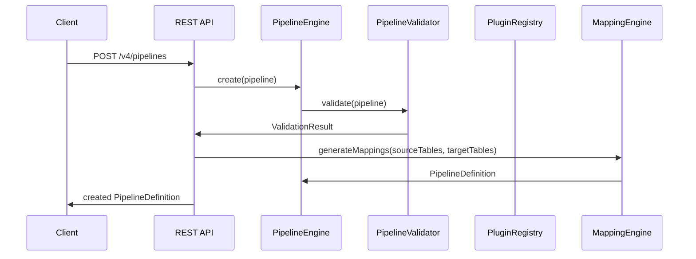

# Debezium AI — Developer Guide

## Overview

This document provides comprehensive guidance for developers working on the Debezium AI platform, including architectural decision logs, coding standards, and implementation details for the v4 multi-module architecture.

## Table of Contents

- [Architecture Overview](#architecture-overview)
- [Module Structure](#module-structure)
- [Core Module](#core-module)
- [AI Module](#ai-module)
- [API Module](#api-module)
- [Monitoring Module](#monitoring-module)
- [Plugins Module](#plugins-module)
- [NoSQL Module](#nosql-module)
- [Authentication & RBAC](#authentication--rbac)
- [Pipeline Export/Import](#pipeline-exportimport)
- [Code Standards](#code-standards)
- [Testing Guidelines](#testing-guidelines)
- [Deployment Process](#deployment-process)
- [Contributing](#contributing)

---

## Architecture Overview

Debezium AI is built on top of the Debezium CDC platform (v3.7.0-SNAPSHOT) and provides intelligent pipeline generation with AI/ML capabilities.

### High-Level Architecture

```
┌────────────────────────────────────────────────────────────────────────────┐
│                         Debezium AI v4.0.4                                  │
├──────────┬──────────┬──────────┬─────────────┬───────────────┬─────────────┤
│   core   │    ai    │   api    │  monitoring  │   plugins     │   nosql     │
│          │          │          │              │               │             │
│ AuthSvc  │Mapping   │REST      │Metrics       │ConnectorPlugin│NoSqlStore   │
│ UserSvc  │Engine    │Resources │Collector     │TransformerPln │JobHistory   │
│ RBACFlt  │Embedding │DTO       │EventBus      │DeploymentPln  │ConfigStore  │
│ Pipeline │LLMService│OpenAPI   │Health        │PluginRegistry │MongoDBImpl  │
│ Export   │Vector    │Auth      │Dashboards    │               │             │
│ Release  │Store     │Export    │Audit         │MySQL/Postgres │             │
│ NoSqlInt │Feedback  │          │              │Docker/Strimzi │             │
├──────────┴──────────┴──────────┴──────────────┴───────────────┴─────────────┤
│                         Debezium Core (3.7.0)                               │
│  API │ Config │ Common │ Connectors │ Storage │ Embedded │ Sink              │
├─────────────────────────────────────────────────────────────────────────────┤
│                     JDBC / Kafka Connect / Kubernetes                        │
└─────────────────────────────────────────────────────────────────────────────┘
```

### Module Interactions

1. **core module** provides data models, pipeline engine, validation, SPI interfaces, authentication, authorization (RBAC), and export/import services
2. **ai module** generates schema mappings using embeddings and LLM suggestions
3. **api module** exposes all functionality through REST endpoints with security
4. **monitoring module** collects metrics, provides health checks, and tracks events/audits
5. **plugins module** implements connectors, transformers, and deployment plugins
6. **nosql module** provides pluggable storage backends (MongoDB) for job history and configuration

### Communication Flow

- **Pipeline Instance Lifecycle**



---

## Module Structure

Each module is an independent Maven project with its own dependencies and lifecycles, while maintaining seamless inter-module communication.

### 1. Core Module (`debezium-pipeline-v4-core`)

**Package:** `io.debezium.v4.core`

**Purpose:** Foundation module containing all domain models, the pipeline engine, SPI interfaces, and validation logic.

**Key Components:**

#### 1.1 Data Models (all Java Records with Builders)

| Class | Purpose |
|---|---|
| `PipelineDefinition` | Central pipeline definition with tenant context, pipeline metadata, source/target configs, mappings, transformations, deployment, monitoring, tags, and metadata |
| `PipelineStatus` | Enum: DRAFT, VALIDATING, VALID, INVALID, DEPLOYING, DEPLOYED, RUNNING, DEGRADED, FAILED, STOPPED, ARCHIVED |
| `PipelineMetadata` | Internal tracking of creation, updates, deployment history |
| `SourceSpec` | Source configuration: type, connector, schema selection, snapshot config |
| `TargetSpec` | Target configuration: type, connector, topic config, sink config |
| `ConnectorConfig` | Connector class, name, configuration map, secrets map |
| `SchemaSelection` | Table/ column patterns, includeAll flag |
| `SnapshotConfig` | Mode, fetch size, select override columns |
| `TopicConfig` | Prefix, naming strategy, regex pattern, partitions, replication factor |
| `SinkConfig` | Sink type and properties |
| `TableMappingSpec` | Source/target table + schema, column mappings, transformations, match type, confidence, enabled |
| `ColumnMappingSpec` | Source/target column + datatype, nullable, pk, transformation rule, confidence, match type |
| `TransformationSpec` | Name, type, order, configuration, predicate, description |
| `DeploymentSpec` | Deployment type, target environment, namespace, cluster config, resources, scaling, network, environment, labels, annotations |
| `ResourceSpec` | CPU/memory limits/requests, storage limits/requests |
| `ScalingSpec` | Min/max replicas, metric, target utilization, stabilization window |
| `NetworkSpec` | Service type, port, target port, annotations, ingress config |
| `IngressSpec` | Enabled flag, host, path, TLS configuration |
| `MonitoringSpec` | Metrics enabled, health enabled, port, alert rules, dashboard references |
| `AlertRuleSpec` | Rule name, metric, condition, threshold, severity, duration, notifications |
| `TenantContext` | Tenant ID, organization, environment |

#### 1.2 Pipeline Engine

**Class:** `PipelineEngine`

**Responsibility:** In-memory pipeline lifecycle management.

**Key Methods:**

```java
public PipelineDefinition create(PipelineDefinition pipeline)
public Optional<PipelineDefinition> get(String id)
public List<PipelineDefinition> list()
public List<PipelineDefinition> list(String tenantId)
public PipelineDefinition update(String id, PipelineDefinition pipeline)
public PipelineDefinition delete(String id)
public PipelineDefinition duplicate(String id)
public PipelineInstance deploy(String id)
public PipelineInstance getInstance(String id)
```

**Features:**

- ConcurrentHashMap-based storage for high throughput
- Atomic operations for consistency
- Pipeline instance tracking for deployment state
- Tenant-based isolation support

#### 1.3 SPI Interfaces

**Abstract Base:** `PipelinePlugin`

```java
public interface PipelinePlugin {
    String name();
    String version();
    String type();
    Map<String, Object> getDefaultConfig();
    Map<String, Object> getConfigSchema();
    void onBeforeCreate(PipelineDefinition pipeline);
    void onAfterCreate(PipelineDefinition pipeline, PipelineInstance instance);
    void onBeforeDeploy(PipelineInstance instance);
    void onAfterDeploy(PipelineInstance instance);
}
```

**Specialized SPIs:**

| Interface | Extends | Purpose |
|---|---|---|
| `ConnectorPlugin` | `PipelinePlugin` | Connector-specific configurations |
| `TransformerPlugin` | `PipelinePlugin` | Data transformation logic |
| `DeploymentPlugin` | `PipelinePlugin` | Deployment-specific generation |

#### 1.4 Pipeline Validator

**Class:** `PipelineValidator`

**Purpose:** End-to-end validation of pipeline definitions with detailed error reporting.

**Validation Categories:**

- **Structure Validation:** Name patterns, required fields, requiredTenant, structure compliance
- **Configuration Validation:** Connector-specific config validation, schema introspection, connection tests
- **Deployment Validation:** K8s namespace validity, resource format, scaling configuration
- **Monitoring Validation:** Alert rule syntax, dashboard compatibility, health check configuration
- **Integration Validation:** Kafka connectivity, schema registry availability, authentication

**Severity Levels:**

- **ERROR** — Invalid, prevents pipeline use, no fallback
- **WARNING** — Issues present, but functional, suggest corrective actions
- **INFO** — Information, pipeline valid, suggestions for optimization

### 2. AI Module (`debezium-pipeline-v4-ai`)

**Package:** `io.debezium.v4.ai`

**Purpose:** AI/ML engine for automated schema mapping, embeddings generation, and learning from user feedback.

**Key Components:**

#### 2.1 Mapping Engine

**Class:** `MappingEngine`

**Purpose:** Generate smart mappings between source and target schemas.

**Input:**

- List of source tables (SchemaTable)
- List of target tables (SchemaTable)
- Configuration options for similarity thresholds, confidence levels, LLM prompts

**Output:**

- Generated TableMappingSpec (table-level mappings)
- Generated ColumnMappingSpec (column-level mappings)
- Confidence scores (0.0-1.0) for each mapping
- Automatic vs. manual confirmation flags

**Implementation Details:**

The engine uses a multi-stage approach:

```java
1. SchemaAnalysisStage: Extract table/column info from both schemas
2. SchemaComparisonStage: Match tables by name, structure, column count
3. ColumnMatchingStage: Match columns by name similarity, type compatibility, nullability, pk
4. EmbeddingMatchingStage: Generate embeddings for columns, find semantic matches
5. LMMEnhancementStage: Send matched columns to LLM for suggestions
6. ConfidenceScoringStage: Calculate confidence based on match quality
7. ResultAggregationStage: Generate final mapping recommendations
```

#### 2.2 Embedding Service

**Class:** `EmbeddingService`

**Purpose:** Generate vector representations of schema elements for semantic similarity matching.

**Providers:**

| Provider | Model | Dimensions | Local/External |
|---|---|---|---|
| MiniLM | all-MiniLM-L6-v2 | 384 | Local |
| Ollama | nomic-embed-text | 768 | Local |
| VoyageAI | voyage-code-2 | 1024 | Cloud |
| HuggingFace | bert-base-uncased | 768 | Cloud |

**Key Methods:**

```java
public float[] embedField(String fieldName, String dataType, String description)
public float[] embedText(String text)
public float[] embedSchema(SchemaTable schemaTable)
public double similarity(float[] vecA, float[] vecB)
public List<VectorEntry> searchSimilarVectors(float[] queryVector, int topK)
```

**Features:**

- Lazy loading with caching (L1 in-process, L2 Redis)
- Async processing for non-blocking UI
- Provider failover handling

#### 2.3 LLM Service

**Class:** `LLMService`

**Purpose:** Integrate with Large Language Models for intelligent mapping suggestions and SQL generation.

**Providers:**

| Provider | Supported Models | API Endpoint | Local |
|---|---|---|---|
| OpenAI | GPT-3.5, GPT-4 | OpenAI API | ❌ |
| Ollama | llama3.1, mistral, codellama | REST API | ✅ |
| Anthropic | Claude-3 | Anthropic API | ❌ |

**Key Methods:**

```java
public String ask(String prompt)
public CompletableFuture<String> askAsync(String prompt)
public MappingRecommendation suggestMappings( SchemaAnalysisContext context)
public String generateKSQL(TransformationChain chain)
public String generateFlinkSQL(TransformationChain chain, Map<String, String> sourceToTarget)
```

**Prompt Engineering:**

LLMs are prompted with structured context including:
- Source schema summary (tables, column names, types)
- Target schema summary
- Explicit mapping constraints
- Transformer/SMT requirements
- Target connector limitations

#### 2.4 Vector Store

**Class:** `VectorStore`

**Purpose:** Store and search embeddings for semantic field matching.

**Storage Backend:**

- In-memory ConcurrentHashMap (development)
- Redis with TTL (production)
- Cassandra/ScyllaDB (large-scale)

**Key Methods:**

```java
public void insert(String id, float[] vector, Map<String, Object> metadata)
public void insertBatch(List<VectorEntry> entries)
public VectorEntry get(String id)
public List<VectorEntry> search(float[] queryVector, int topK)
public List<VectorEntry> searchWithFilter(float[] queryVector, Map<String, Object> filter, int topK)
public void delete(String id)
```

**Similarity Metrics:**

- Cosine similarity (standard)
- Dot product (for embeddings in same space)
- Manhattan distance (alternative)

#### 2.5 Feedback Trainer

**Class:** `FeedbackTrainer`

**Purpose:** Learn from user feedback to improve mapping accuracy over time.

**Learning Mechanism:**

The trainer adjusts weight factors for different matching criteria based on acceptance/rejection patterns:

- **Name matching weight**: Boosted for exact name matches (-0.01 each rejection)
- **Type matching weight**: Adjusted based on type conflicts (-0.005 each rejection)
- **Primary key matching weight**: Higher confidence for PK matches (+0.01 each acceptance)
- **Nullability matching weight**: Adjusted for nullability mismatches

**Usage Example:**

```java
FeedbackTrainer trainer = new FeedbackTrainer();
trainer.recordFeedback(mappingId, userAction, confidenceScore, feedbackComment);

// Get adjusted weights for next mapping
Map<String, Double> weights = trainer.getCurrentWeights();
```

### 3. API Module (`debezium-pipeline-v4-api`)

**Package:** `io.debezium.v4.api`

**Purpose:** REST API layer exposing all v4 functionality with security and unified response format.

**Key Components:**

#### 3.1 REST Resources

**Base Path:** `/v4`

**Security:** API key authentication required (X-API-Key header)

| Resource Class | Base Path | Description |
|---|---|---|
| `PipelineResource` | `/v4/pipelines` | Full CRUD operations for pipelines |
| `MappingResource` | `/v4/mappings` | AI mapping suggestions and embedding utilities |
| `ConnectorResource` | `/v4/connectors` | Available connector plugins and their config schemas |
| `DeploymentResource` | `/v4/deployments` | Deployment artifact generation |
| `MetricsResource` | `/v4/metrics` | Metrics and alerts management |

#### 3.2 API Key Filter

**Class:** `ApiKeyFilter`

**Implementation:** JAX-RS ContainerRequestFilter

**Security Rules:**

- **Public endpoints:** `/v4/health`, `/v4/openapi`, `/q/health`, `/q/metrics`
- **Protected endpoints:** All other v4 endpoints
- **Authentication:** `X-API-Key` header or `Authorization: Bearer <token>`
- **Validation:** Configuration via environment variable `debezium.api.key`

#### 3.3 Unified Response DTO

**Class:** `ApiResponse<T>`

**Purpose:** Consistent API response format across all REST endpoints.

```java
public record ApiResponse<T>(
    boolean success,      // Overall request success
    String message,       // Human-readable message
    T data,               // Response payload (may be null)
    Map<String, Object> metadata,  // Additional metadata
    Instant timestamp    // Request timestamp
) {}
```

**Factory Methods:**

```java
public static <T> ApiResponse<T> ok(T data)
public static <T> ApiResponse<T> ok(T data, String message)
public static <T> ApiResponse<T> ok(T data, Map<String, Object> metadata)
public static <T> ApiResponse<T> error(String message)
public static <T> ApiResponse<T> error(String message, Map<String, Object> metadata)
```

### 4. Monitoring Module (`debezium-pipeline-v4-monitoring`)

**Package:** `io.debezium.v4.monitoring`

**Purpose:** Comprehensive observability infrastructure for the pipeline platform.

**Key Components:**

#### 4.1 Metrics Collector

**Class:** `MetricsCollector`

**Features:**

- Multi-dimensional metric tracking (min/max/sum/count)
- Alert rules with threshold-based evaluation
- Historical data with configurable retention
- Performance metrics for pipeline operations

**Alert Rules:**

```java
public class AlertRule {
    String name;
    String metricName;
    Operator operator;      // GREATER_THAN, LESS_THAN, EQUAL_TO, CHANGED
    long threshold;
    Severity severity;      // INFO, WARNING, CRITICAL
}
```

#### 4.2 Health Indicator

**Class:** `HealthIndicator`

**Purpose:** System-wide health monitoring with pluggable health checks.

**Usage:**

```java
// Register health check
healthIndicator.register("database", () -> {
    // Your health check logic
    return new HealthResult(Status.UP, "Database is healthy", Map.of());
});

// Get overall health status
Map<String, Object> report = healthIndicator.checkAll();
```

#### 4.3 Event Bus

**Class:** `EventBus`

**Purpose:** Internal event streaming for real-time data flow.

**Key Features:**

- Topic-based pub/sub messaging
- Historical event log (5,000 events max)
- Time-based event filtering
- Thread-safe implementation for high throughput

#### 4.4 Dashboard Manager

**Class:** `DashboardManager`

**Purpose:** CRUD operations for monitoring dashboards.

**Widget Types:**

- **COUNTER** — Numerical counters with change indication
- **TIME_SERIES** — Line charts with time axis
- **TABLE** — Data tables with sorting/filtering
- **PIE_CHART** — Pie charts for proportional data
- **BAR_CHART** — Bar charts for comparative data
- **HEAT_MAP** — Heat maps for spatial or matrix data
- **TOPOLOGY** — Network topology diagrams
- **LOG_VIEWER** — Real-time log streaming
- **STATUS_INDICATOR** — Status indicators with color coding

#### 4.5 Audit Logger

**Class:** `AuditLogger`

**Purpose:** Immutable audit trail for all user actions.

**Recorded Actions:**

- Pipeline creation, updates, deletion, deployment
- Schema introspection operations
- AI mapping suggestions and user feedback
- API key authentication events
- Dashboard and widget modifications

**Retention:** 10,000 entries with filtering by entity and time.

### 5. Plugins Module (`debezium-pipeline-v4-plugins`)

**Package:** `io.debezium.v4.plugins`

**Purpose:** Extensible plugin system for connectors, transformers, and deployment formats.

**Key Components:**

#### 5.1 Plugin Registry

**Class:** `PluginRegistry`

**Features:**

- Type-safe plugin discovery and loading
- CDI bean scanning for automatic plugin registration
- Runtime plugin registration/unregistration
- Plugin metadata tracking and validation

#### 5.2 Plugin Metadata

**Class:** `PluginMetadata`

```java
public record PluginMetadata(
    String name,
    String version,
    String description,
    String vendor,
    PluginType type,
    List<String> dependencies,
    Map<String, String> attributes,
    Instant loadedAt
) {}
```

**Plugin Types:**

- `CONNECTOR` — Database connectors (MySQL, PostgreSQL, MongoDB)
- `TRANSFORMER` — Data transformation plugins
- `DEPLOYMENT` — Deployment format plugins
- `PREDICATE` — Condition evaluation for transformation routing
- `CONVERTER` — Data type conversions
- `SINK` — Data sink implementations
- `SOURCE` — Additional source types

#### 5.3 Built-in Plugins

##### 5.3.1 Connector Plugins

###### MySQL Connector Plugin

**Class:** `MySqlConnectorPlugin`

**Configuration Schema:**

```json
{
    "connector.class": "io.debezium.connector.mysql.MySqlConnector",
    "database.hostname": {"type": "string", "required": true},
    "database.port": {"type": "integer", "default": 3306},
    "database.user": {"type": "string", "required": true},
    "database.password": {"type": "string", "secret": true, "required": true},
    "database.server.name": {"type": "string", "required": true},
    "database.include.list": {"type": "string"},
    "table.include.list": {"type": "string"},
    "snapshot.mode": {"type": "string", "default": "initial"},
    "topic.prefix": {"type": "string", "required": true}
}
```

###### PostgreSQL Connector Plugin

**Class:** `PostgresConnectorPlugin`

**Connector-Specific Config:**

- `plugin.name` — `pgoutput`, `wal2json`, `decoderbufs`
- `slot.name` — Logical decoding slot name
- `publication.name` — PostgreSQL publication name

###### MongoDB Connector Plugin

**Class:** `MongoDbConnectorPlugin`

**Differences:**

- Uses MongoDB oplog or change streams
- No JDBC introspection required
- Different configuration schema for connection

##### 5.3.2 Deployment Plugins

###### Strimzi Deployment Plugin

**Class:** `StrimziDeploymentPlugin`

**Output:** Kubernetes YAML for KafkaConnector Custom Resource

```yaml
apiVersion: kafka.strimzi.io/v1beta2
kind: KafkaConnector
metadata:
  name: my-pipeline
  labels:
    strimzi.io/cluster: debezium-connect
spec:
  class: io.debezium.connector.mysql.MySqlConnector
  tasksMax: 1
  config:
    database.hostname: ${DB_HOST}
    database.user: ${DB_USER}
    database.password: ${DB_PASSWORD}
    topic.prefix: debezium
```

###### Docker Compose Deployment Plugin

**Class:** `DockerComposeDeploymentPlugin`

**Output:** `docker-compose.yml` for development/testing

### 6. NoSQL Module (`debezium-pipeline-v4-nosql`)

**Package:** `io.debezium.v4.nosql`

**Purpose:** Pluggable storage backend for persisting pipeline job history and configuration data.

**Key Components:**

#### 6.1 NoSqlStore Interface

**File:** `io.debezium.v4.core.nosql.NoSqlStore`

```java
public interface NoSqlStore {
    void store(String collection, String key, Map<String, Object> data);
    Optional<Map<String, Object>> retrieve(String collection, String key);
    List<Map<String, Object>> query(String collection, Map<String, Object> filters);
    void delete(String collection, String key);
    boolean exists(String collection, String key);
}
```

#### 6.2 JobHistoryStore

**Class:** `io.debezium.v4.nosql.JobHistoryStore`

**Purpose:** Persist pipeline execution records for long-term analysis and debugging.

**Recorded fields:**
- Pipeline ID and name
- Start/end timestamps and duration
- Status (SUCCESS, FAILED, RUNNING)
- Error messages and stack traces
- Metrics snapshot at completion

#### 6.3 ConfigStore

**Class:** `io.debezium.v4.nosql.ConfigStore`

**Purpose:** Indexed configuration storage with field-based lookups.

**Features:**
- JSON document storage
- Field-level indexing for fast queries
- TTL-based expiration for temporary configs

#### 6.4 MongoDB Implementation

**Class:** `io.debezium.v4.nosql.mongodb.MongoDbNoSqlStore`

**Dependency:** MongoDB driver 4.x

**Configuration:**
```properties
debezium.nosql.type=mongodb
debezium.nosql.mongodb.uri=mongodb://localhost:27017
debezium.nosql.mongodb.database=debezium_ai
debezium.nosql.mongodb.job-collection=job_history
debezium.nosql.mongodb.config-collection=configurations
```

---

## Authentication & RBAC

### AuthService

**Package:** `io.debezium.v4.core.auth`

**Purpose:** Handle user authentication via username/password and SSO/OIDC providers.

**Key Methods:**
```java
public AuthSession login(String username, String password)
public AuthSession ssoLogin(String provider, String code, String redirectUri)
public void logout(String sessionId)
public Optional<AuthSession> validateSession(String sessionId)
public User register(String username, String password, String email)
```

### UserService

**Package:** `io.debezium.v4.core.auth`

**Purpose:** Manage users, roles, and permissions.

**Key Methods:**
```java
public User createUser(User user)
public User updateUser(String username, User user)
public void deleteUser(String username)
public List<User> listUsers()
public List<Role> listRoles()
public List<Permission> listPermissions()
public Optional<User> getUser(String username)
```

### RBACFilter

**Package:** `io.debezium.v4.core.auth`

**Purpose:** JAX-RS ContainerRequestFilter that enforces role-based access on every endpoint.

**RBAC Role Hierarchy:**
| Role | Key Permissions |
|---|---|
| SUPER_ADMIN | Full system access, tenant management, user management |
| ADMIN | Full access within tenant |
| PIPELINE_MANAGER | CRUD + deploy pipelines |
| PIPELINE_OPERATOR | Start/stop/monitor pipelines |
| PIPELINE_VIEWER | Read-only pipeline access |
| CONNECTOR_ADMIN | Manage connector configurations |
| DATA_ENGINEER | AI mappings, schema introspection, transforms |
| AUDITOR | Read-only audit log access |
| DEVELOPER | API access for integrations |

### SSO/OIDC Integration

Supports Keycloak, Google, GitHub, and Azure AD:

```properties
debezium.auth.sso.keycloak.url=http://localhost:8081
debezium.auth.sso.keycloak.realm=debezium
debezium.auth.sso.keycloak.client-id=debezium-ai
debezium.auth.sso.keycloak.client-secret=<secret>
debezium.auth.sso.google.client-id=<google-client-id>
debezium.auth.sso.github.client-id=<github-client-id>
debezium.auth.sso.azure.client-id=<azure-client-id>
```

---

## Pipeline Export/Import

**Package:** `io.debezium.v4.core.export`

**Purpose:** Serialize pipelines to JSON packages for environment promotion and release management.

### ExportService

**Class:** `io.debezium.v4.core.export.ExportService`

```java
public PipelineExportRecord exportPipelines(List<String> pipelineIds, String sourceEnv, String targetEnv)
public ReleasePackage createRelease(List<String> pipelineIds, String version, String releaseNotes)
public PipelineExportRecord exportEnvironment(String environment)
public List<PipelineDefinition> importPipelines(String json, String targetEnvironment)
```

### PipelineExportRecord

**Fields:** pipeline IDs, source/target environment, exported at timestamp, pipeline definitions with environment overrides

### ReleasePackage

**Fields:** version, release notes, pipeline definitions, metadata, created at timestamp

### Environment Overrides

Configuration values are automatically adjusted when promoting across environments:
- `database.hostname`: `dev-db` → `qa-db` → `prod-db`
- `bootstrap.servers`: `dev-kafka:9092` → `qa-kafka:9092` → `prod-kafka:9092`
- `topic.prefix`: `dev.` → `qa.` → `prod.`

---

## Code Standards

#### Java Coding Standards

- **Line length:** Maximum 120 characters
- **Indentation:** 4 spaces (no tabs)
- **Naming conventions:** camelCase for methods/variables, PascalCase for classes
- **Documentation:** Javadoc for all public APIs, inline comments for complex logic
- **Code organization:** Logical grouping, single responsibility per method

#### Security Best Practices

- **Authentication:** API key + username/password + SSO/OIDC, no hardcoded secrets
- **Authorization:** Fully implemented RBAC with 9 roles and per-endpoint permission checking
- **Input validation:** Comprehensive validation for all API endpoints
- **Error handling:** Generic error messages to clients, detailed logs internally
- **Logging:** Audit logging for all sensitive operations

#### Testing Standards

- **Unit tests:** JUnit 5 with Mockito for isolated component testing
- **Integration tests:** Testcontainers for database interactions
- **API tests:** REST Assured for endpoint validation
- **Contract tests:** OpenAPI specification validation
- **Performance tests:** Load testing for high-throughput scenarios

---

## Appendix

### Common Error Codes

| Code | Description |
|---|---|
| `PIPELINE_NOT_FOUND` | Pipeline with given ID not found |
| `PIPELINE_ALREADY_EXISTS` | Pipeline name already in use |
| `VALIDATION_FAILED` | Pipeline configuration validation failed |
| `CONNECTOR_NOT_SUPPORTED` | Requested connector not supported |
| `AUTH_FAILED` | Invalid API key or authentication failure |
| `METRICS_UNAVAILABLE` | Metrics collection or storage failure |

### Configuration Examples

#### application.properties

```properties
# Debezium AI configuration
quarkus.http.port=8080

# API authentication
debezium.api.key=${API_KEY}

# Auth / SSO / RBAC
debezium.auth.enabled=true
debezium.auth.jwt.secret=${JWT_SECRET}
debezium.auth.admin.username=admin
debezium.auth.admin.password=${ADMIN_PASSWORD}
debezium.auth.sso.keycloak.url=http://localhost:8081
debezium.auth.sso.keycloak.realm=debezium

# Plugin registry
debezium.plugins.scan-cdi=true

# Export
debezium.export.directory=./exports

# NoSQL Storage
debezium.nosql.type=mongodb
debezium.nosql.mongodb.uri=mongodb://localhost:27017
debezium.nosql.mongodb.database=debezium_ai

# Monitoring
prometheus.metrics.enabled=true
opentelemetry.service.name=debezium-ai

# AI configuration
debezium.ai.embeddings.provider=minilm
debezium.ai.llm.provider=ollama
```

#### Environment Variables

| Variable | Default | Description |
|---|---|---|
| `DEBEZIUM_API_KEY` | Required | API key for authentication |
| `DEBEZIUM_AUTH_ENABLED` | true | Enable auth/SSO/RBAC |
| `DEBEZIUM_AUTH_JWT_SECRET` | Required | JWT signing secret |
| `DEBEZIUM_AUTH_ADMIN_PASSWORD` | Required | Default admin password |
| `DEBEZIUM_NOSQL_MONGODB_URI` | `mongodb://localhost:27017` | MongoDB connection URI |
| `DEBEZIUM_EXPORT_DIRECTORY` | `./exports` | Export output directory |
| `DB_HOST` | localhost | Database host for schema introspection |
| `DB_PORT` | Connector-specific | Database port |
| `DB_USER` | connector-specific | Database username |
| `DB_PASSWORD` | connector-specific | Database password |

### Migration Guide (v3 -> v4)

#### Breaking Changes

1. **API Base Path:** `/api/v1` → `/v4`
2. **Authentication:** Now required (previously none) — supports username/password + SSO + API key
3. **RBAC:** Authorization enforced for all endpoints (9 roles)
4. **Response Format:** Maps → Unified ApiResponse wrapper
5. **Plugin System:** Hardcoded connectors → SPI with registry
6. **Mapping Algorithm:** Heuristic only → AI (embeddings + LLM)
7. **New Modules:** nosql, auth, export modules add runtime dependencies (MongoDB optional)

#### Migration Steps

1. Update API endpoints: `http://host:8080/v4/...`
2. Obtain API key from environment: `debezium.api.key`
3. Update client code to handle ApiResponse wrapper
4. Update plugin discovery: Scan for `@ApplicationScoped` annotations
5. Update mapping logic: Use `/v4/mappings/suggest` endpoint
6. (Optional) Configure MongoDB for NoSQL storage: add `debezium.nosql.mongodb.uri`
7. (Optional) Configure SSO providers: add `debezium.auth.sso.*` properties
8. Update deployment pipeline to include export step in CI/CD

#### Compatibility

- **Backward compatible** for schema introspection (`/api/v1/schema/tables`)
- **Partial compatibility** for health checks (same endpoints)
- **Fully compatible** for Debezium core functionality

---

This guide is continuously updated. For questions or clarifications, please consult with the development team.